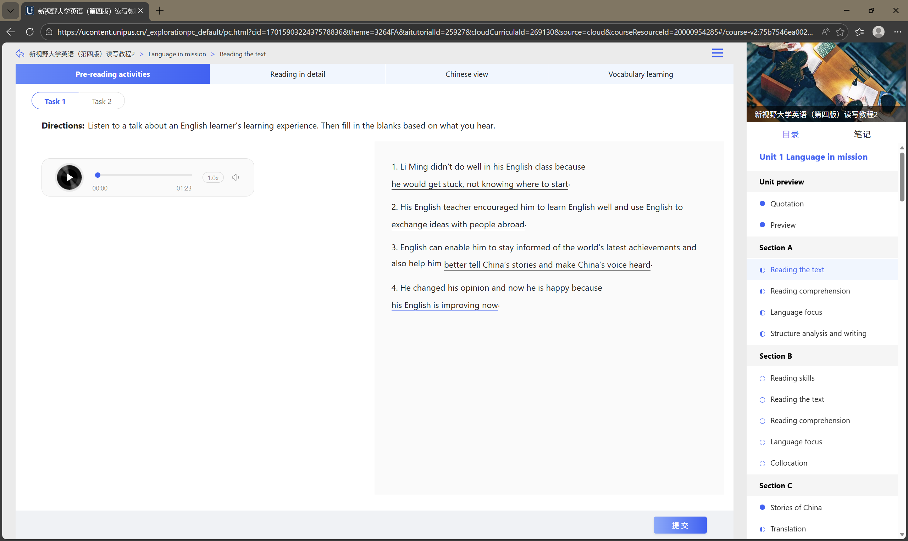

# U校园AI版刷课脚本
### 大学英语的刷课可谓既浪费时间又没有太多意义，我曾经在网上查过很多关于U校园AI版的刷课脚本，但是都无法使用。于是我决定既然没有那就自己创造。
### 作者Bilibili主页[点击查看](https://space.bilibili.com/556022848)


## 主要功能


- **功能1:** 全自动程序，解放双手
- **功能2:** 接入KIMI API，实现AI答题


## 使用技术


- HTML, JavaScript
- Python，Selenium

## 环境依赖
- 本项目需要Python环境
- 需要安装Microsoft Edge浏览器和Microsoft Edge WebDriver驱动程序[点击下载](https://developer.microsoft.com/zh-cn/microsoft-edge/tools/webdriver)
## 使用方法
### 对于想要了解代码的用户
1. 在PyCharm或其他IDE中克隆此仓库
2. 运行``` pip install -r requirements.txt ```安装依赖
3. 修改config.json
4. 运行Unipus_v1.0.py
### 对于只想要体验程序功能的用户
- 只需要下载右侧release里的dist.zip，解压后编辑config.json，运行exe即可
- 仍然需要安装Microsoft Edge浏览器和Microsoft Edge WebDriver驱动程序[点击下载](https://developer.microsoft.com/zh-cn/microsoft-edge/tools/webdriver)
## 注意：启动后严禁一切操作，否则可能导致程序异常
## 在config.json里编辑配置
1. 把"Your username"替换为你的账号，把"Your password"替换为你的密码
2. 把“Your api"替换为你在[KIMI开放平台](https://platform.moonshot.cn/docs/guide/start-using-kimi-api)申请的API KEY
3. 两种学习策略,"learn_all"为学习所有课程，“learn_all_compulsory_course”为学习必修课
4. full_token需要改为自己的token，详见《关于U校园ai版的防作弊机制》
## 关于U校园ai版的防作弊机制
- 我已破解
- 手动在浏览器登陆账号，然后打开开发者窗口在控制台输入localStorage.getItem('__token')
把获取的token粘贴到config.json中的token_full中（注意格式一致）
- 此token会不定期更新，如果发现登陆进去是白屏，那么需要更新token

## 补充说明：由于程序是根据读写教程编写的，所以在处理视听说教程时可能无法正常使用，有待后续完善
## v1.1更新
新增config编辑工具，位于
### /net10.0-windows/ConfigEditor.exe
## v2.0更新
- 新增了以下题型的支持

- 修复了部分情况下选择题ai调用失败的问题
- 修复了有时阅读题答案用中文回答的问题
## 📜 许可证

本项目在[MIT License](LICENSE)下发布。