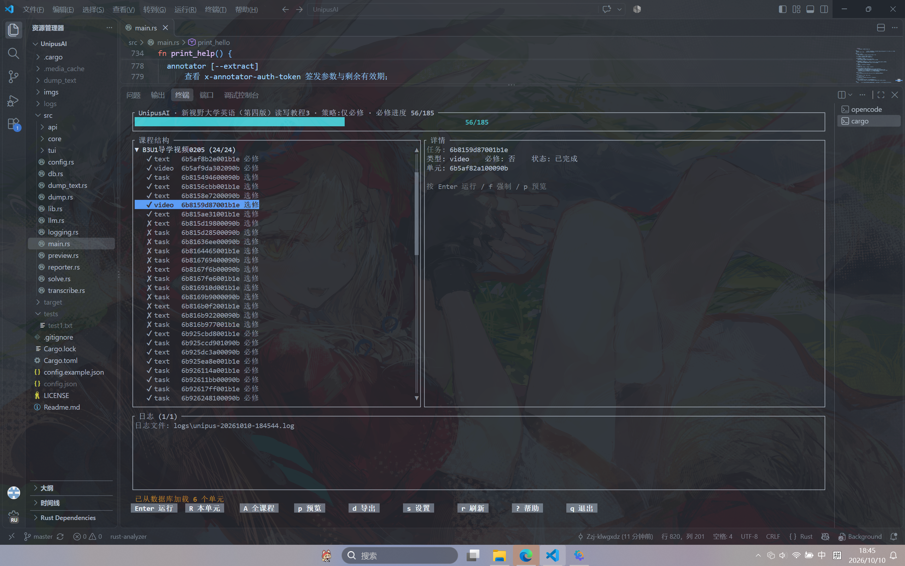
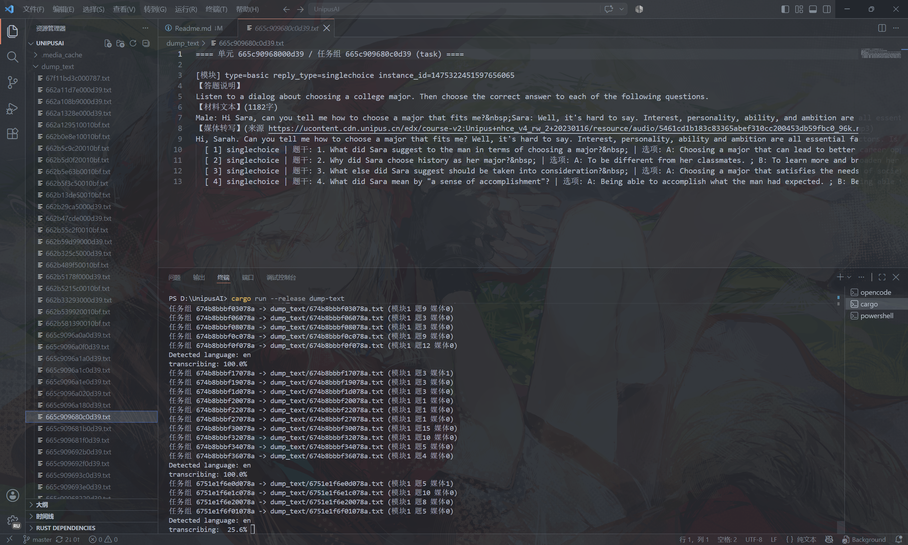
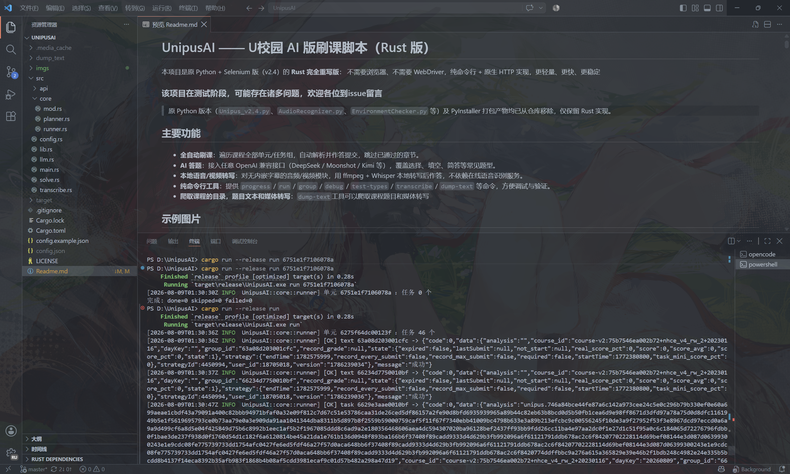
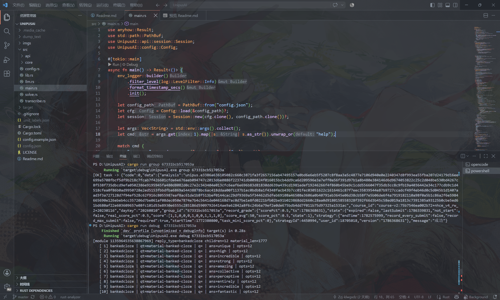

# UnipusAI —— U校园 AI 版刷课脚本

本项目是原 Python + Selenium 版（v2.4）的 **Rust 完全重写版**：
不需要浏览器、不需要 WebDriver，原生 HTTP 实现，更轻量、更快、更稳定
> 原 Python 版本（`Unipus_v2.4.py`、`AudioRecognizer.py`、`EnvironmentChecker.py` 等）已归档到v2.4分支。
### 如想用浏览器自动化方案请看[v2.4分支（bug较多）](https://github.com/Zzj-klwgxdz/UnipusAI/tree/v2.4)或者[这个（更推荐）](https://github.com/YSJohnson/UnipusAI-Helper),这个项目继承了原python版本的主要功能，并优化了用户体验
### 该项目在测试阶段，可能存在诸多问题，欢迎各位到issue留言
### 因为程序可能对部分题型没有适配完全，所以可能部分题目程序作答提交的成绩为0。请勿无脑使用一键刷题命令，由此导致的一切后果请自行承担
### 如果你是从视频平台过来的，如果不会使用尽量不要通过评论区或私信向我提问（大概率不回），请向ai（豆包，deepseek等）提问：“阅读这个项目`https://github.com/Zzj-klwgxdz/UnipusAI`，我应该如何使用。” 或者通过agent工具直接让它配置好。

## 主要功能

- **运行日志**：每次运行在 `logs/` 生成独立日志文件（本地时间命名，如 `unipus-20261009-214732.log`），启动时自动清理 3 天前的旧日志；CLI 与 TUI 均记录。
- **纯命令行工具**：提供 `progress` / `run` / `group` / `debug` / `test-types` / `transcribe` / `dump-text` 等命令，方便调试与验证。
- **交互式 TUI**：直接运行 `UnipusAI`（无参数）进入终端界面：浏览课程/单元/任务、运行与取消、dump 总览与导出、配置编辑，支持鼠标（ratatui）；任务树与预览全部来自本地数据库，可离线浏览，支持单任务重抓。
- **全自动刷课**：遍历课程全部单元/任务组，自动解析并作答提交，跳过已通过的章节。
- **AI 答题**：接入任意 OpenAI 兼容接口，覆盖选择、填空、简答等常见题型。
- **讨论题自动发言**：讨论区（discussion）题型自动生成英文发言并发布到讨论区，再标记任务完成。
- **单词卡/朗读练习**：vocabulary 题型无需作答，自动标记完成；`debug`/`dump-text` 可查看单词表。
- **限频自动重试**：提交命中服务端"操作过于频繁"时，自动等待冷却（递增 180s，最多 5 次）后重试。
- **本地语音/视频转写**：对无内嵌字幕的音频/视频模块，用 ffmpeg + Whisper 本地转写后作答，不依赖在线语音识别服务。
- **SQLite 数据归档**：`dump-text` 把课程全部内容存入 `dump_text/dump-<open_id>.db`（**每个账号一个库**，单元索引/题型/必修/完成情况/模块/答题说明/材料/字幕/媒体转写/选项等），dump 或 run/group 答题后自动更新状态。

## 示例图片

*tui*

*dump-text*

*running*

*debug*
## 技术栈

| 组件 | 用途 |
| --- | --- |
| Rust (edition 2024) | 主语言，Tokio 异步运行时 |
| reqwest | HTTP 客户端（rustls、cookie、gzip/brotli） |
| aes / ecb / hex | 题目内容 AES-128-ECB 解密 |
| serde / serde_json | 配置与接口数据序列化 |
| Whisper (whisper-candle-core) | 本地语音转写 |
| FFmpeg | 媒体转 wav 前处理 |

## 项目结构

```
src/
├── main.rs            # 入口：无参数启动 TUI，参数走 CLI 子命令
├── lib.rs             # 模块声明
├── config.rs          # config.json 加载/校验/保存
├── llm.rs             # OpenAI 兼容 LLM 调用（含重试与 reasoning_content 兜底）
├── solve.rs           # 作答策略：选择题/填空/简答 prompt 构造与答案解析
├── transcribe.rs      # 媒体转写：vtt 解析 + ffmpeg + whisper，本地缓存
├── reporter.rs        # 事件上报：ReportEvent + Reporter（CLI 打印 / TUI 转发）
├── dump_text.rs       # dump-text 逻辑（CLI 与 TUI 共用）
├── preview.rs         # 任务组只读预览（debug/TUI 共用）
├── logging.rs         # 运行日志：logs/ 每次运行独立文件、3 天自动清理
├── api/
│   ├── session.rs     # HTTP 会话：默认请求头、Cookie/JWT、统一 get/post、配置热更新
│   ├── content.rs     # 拉取任务内容 + AES 解密
│   ├── course.rs      # 课程/单元进度、任务树构建与筛选
│   ├── parser.rs      # 解密后的题目模块/子题解析、HTML 清洗、媒体 URL 提取
│   ├── bbs.rs         # 讨论区接口：查询/创建主题、发表评论（ucloud BBS）
│   ├── submit.rs      # 构造提交/标记已看 payload 并上报
│   └── user_module.rs # 用户作答记录查询（预留）
├── dump.rs            # dump 数据目录/题型名/数据库路径与状态同步入口
├── db.rs              # SQLite（每账号 dump_text/dump-<open_id>.db）：schema、任务/模块/题目/媒体/单词入库与汇总查询
├── tui/               # ratatui 交互界面
│   ├── mod.rs         # 终端初始化/事件循环/退出恢复
│   ├── app.rs         # AppState + 后台任务（加载/运行/导出/预览/保存）
│   ├── update.rs      # 键盘/鼠标事件处理与状态更新
│   ├── ui.rs          # 各界面渲染（主界面/设置/dump/预览/帮助）
│   ├── events.rs      # crossterm 输入线程
│   └── logger.rs      # log 转发到 TUI 日志面板
└── core/
    ├── planner.rs     # 学习计划：按 learning_strategy 列出待完成任务
    └── runner.rs      # 执行器：逐任务组解析→作答→提交（含取消/限频重试）
```

## 核心实现原理

### 1. 登录态

**推荐：只填账号密码，程序自动登录**（`config.json`）：

- `username` / `password`：U校园通行证手机号/邮箱与密码（本地明文保存）。启动时自动调用 SSO 登录并写回 cookie/open_id/refresh_token：
  - jwt 剩余 > 24h 直接使用；否则先用 refresh_token 刷新；失败再用账号密码重新登录；
  - 刷题过程中接口返回 401 会自动刷新并重试（refresh_token → 账号密码，单飞防并发）；
  - 服务端风控（极验滑块/图形验证码）无法自动通过，会给出明确报错，此时可改用下面的 cookie 方式兜底。
- `x_annotator_auth_token`：**ucontent 内容接口必需的凭证**（约 1 年有效），首次使用需从浏览器复制一次（登录后访问任意课程，在请求头的 `x-annotator-auth-token` 中获取）。
- 讨论题另需 `class_id`（课程列表 classId 自动填充）与 `curricula_id`（页面 URL 的 cloudCurriculaId，切换课程时会清空并提示重填）。

**备选：浏览器 cookie 方式**（与旧版一致）：

- `cookie`：浏览器请求头里的 `Cookie`（含 `jwt=`）；`authorization` 可留空，程序自动用 cookie 中的 `jwt=`。
- `open_id`、`course_id` 等从浏览器请求中获取；也可用 `UnipusAI courses` / `UnipusAI course <序号>` 自动列出并选择。

`Session` 会为每个请求自动附带这些头，以及固定的 `u-app-id`、`u-platform`、`origin`、`referer` 等。

### 2. 任务发现
- `fetch_course_units` 拉取课程进度，得到全部单元 id。
- 对每个单元 `fetch_unit` 得到任务组（leaf）列表，每个 leaf 含 `tab_type`（`text`/`video`/`task`）、是否必修、是否已通过。
- 按 `learning_strategy` 过滤（`learn_all_compulsory_course` 只处理必修任务）。

### 3. 内容解密
任务内容接口返回的 `content` 是密文：

```
格式: "unipus.<hex>" 或 "<hex>"
密钥: "1a2b3c4d" + k 截取前 16 字节
算法: AES-128-ECB + ZeroPadding
```

`decrypt_content` 按此流程逐块解密、去尾部零填充，得到题目的 JSON。

### 4. 题目解析
`parse_group` 把解密后的 JSON 解析成：

```
ParsedGroup
└── Module（一个模块 = 一道大题）
    ├── module_type / reply_type / direction
    ├── material       阅读/听力材料文本（HTML 去标签）
    ├── media_sources  音频/视频/字幕 URL（用于转写）
    ├── transcript     内嵌 WEBVTT 字幕文本
    └── children       子题列表（题干、选项、option_count）
```

媒体 URL 与内嵌字幕会被单独抽取出来，供转写链路使用。

### 5. 作答策略（`solve.rs`）
- **选择题**（singlechoice / multichoice）：把材料/字幕 + 题干 + 选项拼成 prompt，让 LLM 只回答选项字母；再解析为合法选项（`parse_single` / `parse_multi`）。
- **填空/简答**（fillblank / text-area）：整组拼接为一批题目，要求 LLM 按 `1.xxx 2.xxx` 编号回答，再按序拆分（`parse_banked`）。
- **讨论题**（discussion）：根据答题说明与讨论问题让 LLM 生成 100–150 词英文发言（`solve_discussion`），发帖流程见"讨论题"一节。
- **LLM 失败兜底**：可配置随机作答或返回占位答案。

### 6. 媒体转写（`transcribe.rs`）
当模块**既有媒体又没有文本/字幕**时才触发：

```
vtt/srt 字幕 → 直接下载并解析纯文本
音频/视频   → 下载 → ffmpeg 转 16k 单声道 wav → 本地 whisper 转写（纯 Rust，candle 推理）
```

转变语言为 `auto`（或留空）时不传 `--language` 参数，whisper 自动检测语种；也可指定如 `en`/`zh` 强制语言。

结果按 URL 的 SHA1 缓存到 `.media_cache/`，重复转写秒回。内容解密时抽取到的 WEBVTT 字幕会直接作为 `transcript` 使用，无需跑 whisper。

> 转写使用内置的纯 Rust whisper（`whisper-candle-core`，candle 推理），**无需 Python/.venv**。
> 模型（如 `base`）首次使用时自动从 HuggingFace 下载，缓存到 `~/.cache/whisper-candle/`。
> 国内网络可设置环境变量 `HF_ENDPOINT=https://hf-mirror.com` 走镜像下载。

### 7. 讨论题（`bbs.rs`）
讨论题模块（`replyType=discussion`）的答案不在 submit 接口里，而是发布到讨论区（ucloud BBS）：

```
生成发言（direction + 讨论问题 → LLM 英文发言）
  → 查主题 POST /api/bbs/utopic/page（无主题则先 POST /api/bbs/utopic/add 创建）
  → 查重 POST /api/bbs/ureply/top/page（ownerStatus=true 表示本人已回复，跳过）
  → 发帖 POST /api/bbs/ureply/add {type:2, content, topicId, contentType:"text"}
  → 标记完成（纯讨论组走 submitType=2 的"标记已看"提交）
```

- 讨论题可能挂在 `text`/`video` 叶子下，执行器会先尝试解析内容检测 discussion 再发帖。
- `run`/`group` 会自动完成发帖与标记；`debug <groupId>` 只读预览：显示完整发言草稿与讨论区状态（topicId/是否已回复），不发帖不提交。
- BBS 接口成功返回 `code=1`（非 0）。JWT 自动取 cookie 中的 `jwt=`（或 config 的 authorization，谁的 exp 新用谁，401 自动回退）；两者都过期时提示重新复制 cookie。
- `class_id`（URL 的 `cid`）与 `curricula_id`（URL 的 `cloudCurriculaId`）为讨论题必填配置，缺失时服务端返回"班级Id不能为空"/"Ai版课程Id不能为空"。
- 发帖失败时该任务直接判 FAIL（不标记已看），下次运行会重试。

### 8. 单词卡/朗读练习（vocabulary）
模块类型为 `vocabulary`（`contents[]` 为单词卡：单词、发音、释义、例句）的题型**无需作答**：

- 浏览器在录完音后最终提交的也是 `submitType=2` 的"标记已看"载荷（不含任何录音数据），经实测单独提交即可 `pass=true`。
- 程序对这类模块直接走"标记已看"提交（`task` 叶子同样适用）；`solve`/`debug` 不会因空 `replyType` 报错。
- `debug <groupId>` 显示词表摘要；`dump-text` 会导出含单词卡的 `text`/`video` 任务组（单词 + 官方发音链接）。
- 录音与语音评测走腾讯 SOE WebSocket（`zt.unipus.cn/soe/*` + `wss://speech.unipus.cn/speech/proxy/wss`，含服务端签名），程序未复刻，也不影响任务通过。

### 9. 提交
`build_answer_payload` 构造 `submit` 接口所需的 `quesDatas`（每模块一个 instance，每子题一个 answer JSON），连同 `courseId`、`openId`、`publish_version` 等一并提交。`text`/`video` 类任务、纯讨论组、单词卡等无可答子题的任务只调"标记已看"接口。
提交若命中服务端限频（响应 `code=600001/600002`，或 `msg` 含"操作过于频繁"），程序自动等待冷却（递增 180s，最多 5 次）后重试该次提交，仅重做提交、不重复 LLM 作答。

## 使用方法
#### 对于小白，且平台为windows64位，直接下载release，配置好config.json后运行即可
### 下载
使用git克隆仓库
```bash
git clone https://github.com/Zzj-klwgxdz/UnipusAI.git
cd UnipusAI
```
或者在github页面下载zip后解压
### 构建

需要安装 [Rust 工具链](https://rust-lang.org/zh-CN/tools/install/)

```bash
cargo build --release
```
**注意使用release模式编译，使用debug模式会导致转写速度大幅下降**
### 依赖

- **ffmpeg**：语音转写前置，需将ffmpeg的bin文件夹加入系统PATH，例如`C:\ffmpeg\bin`
- **whisper 模型**：转写用模型（默认 `base`），首次转写时**自动**从 HuggingFace 下载并缓存到 `~/.cache/whisper-candle/`；可通过在运行前设置环境变量使用国内镜像。
#### 临时设置环境变量
**powershell**
```bash
$env:HF_ENDPOINT = "https://hf-mirror.com"
```
**cmd**
```bash
set HF_ENDPOINT=https://hf-mirror.com
```
**bash**
```bash
export HF_ENDPOINT=https://hf-mirror.com
```

不配置这两者时程序仍可运行，但是带语音无字幕的题目会缺少材料。
> 经测试Android平台也可以通过termux构建并运行本项目
### 配置

仓库内不包含真实 `config.json`（含隐私凭证，已被 `.gitignore` 排除）。使用前先把模板复制为 `config.json` 再填入自己的信息

编辑 `config.json`：

| 字段 | 必填 | 说明 |
| --- | --- | --- |
| `timeout` | 否 | HTTP 超时秒数，默认 10 |
| `username` / `password` | **推荐** | U校园通行证账号/密码（明文），自动登录并刷新 cookie/open_id/refresh_token |
| `cookie` | 备选必填 | 浏览器登录后的 Cookie（含 `jwt=`）；未填账号密码时使用 |
| `authorization` | 否 | ucontent JWT；**留空即可**，程序会自动用 cookie 中的 `jwt=` 代替 |
| `refresh_token` / `jwt_expire` / `rt_expire` | 自动 | 登录后自动写入，用于免密刷新，无需手填 |
| `x_annotator_auth_token` | 自动 | ucontent 内容接口鉴权 token，本地按前端同算法/参数签发（剩余 <30 天自动续签）；签名参数从 ucontent 前端 bundle **按需动态提取**，密钥轮换时运行中 401 会自动重提取重签；手动粘贴的有效 token 不会被覆盖 |
| `u_school` | 自动 | 学校编号（每次启动从账号信息接口刷新） |
| `course_id` | **是** | 课程 id，如 `course-v2:...`（可用 `UnipusAI course <序号>` 自动选择） |
| `class_id` | 自动 | 班级 id（每次启动从课程列表 classId 刷新） |
| `curricula_id` | 自动 | AI 版课程 id（每次启动从课程列表 id=cloudCurriculaId 刷新） |
| `open_id` | 自动/是 | 用户 open id（自动登录时自动填充） |
| `publish_version` | 自动 | 课程发布版本号（每次启动从课程进度接口刷新） |
| `api_key` | 是 | 大模型 API key |
| `base_url` | 是 | 大模型地址，如 `https://api.deepseek.com` |
| `model` | 是 | 模型名 |
| `learning_strategy` | 否 | `learn_all`（全部）/ `learn_all_compusory_course`（仅必修） |
| `max_tokens` / `temperature` | 否 | LLM 参数 |
| `fallback_on_llm_failure` | 否 | true表示LLM 失败时随机作答，false表示LLM 失败时直接报错 |
| `whisper_enabled` | 否 | 是否启用本地语音转写 |
| `whisper_model` | 否 | whisper 模型（tiny/base/small） |
| `whisper_language` | 否 | 转写语言，`auto`自动检测/可指定 `en`、`zh` |

#### 各项配置如何获取

> 只填 `username`/`password` 时，下文各项都可跳过：凭证类字段全部自动获取/本地签发（`x_annotator_auth_token` 由程序内嵌密钥本地生成）。

以 Microsoft Edge为例：

1. 浏览器登录 U校园（`ucontent.unipus.cn`），进入任意课程。
2. 按 `F12` 打开开发者工具 → `Network` 面板 → 勾选保留日志并刷新页面。
3. 过滤 `ucontent.unipus.cn` 的请求，双击打开一个常见接口（如含 `course_progress` / `content` 的请求）。

逐项复制如下：

| 配置项 | 从哪取 |
| --- | --- |
| `cookie` | 该请求 `Headers` → Request Headers → `Cookie` 整条值（含 `jwt=`） |
| `authorization` | 可选。同一请求头里的 `Authorization`（登录 JWT，`eyJ...`）；留空则自动取 cookie 的 `jwt=` |
| `x_annotator_auth_token` | 同一请求头 `x-annotator-auth-token`（若无该头可留空） |
| `u_school` | 主页里的redDot请求里的`u-school`（学校编号，如 `8320`） |
| `open_id` | 请求 URL 路径中的 open_id 段，在`publish_version`同一个页面|
| `course_id` | 请求 URL 路径中的 `course-v2:...` 段（如 `/course/api/v2/course_progress/course-v2:xxx/`） |
| `class_id` / `curricula_id` | 课程页面地址栏 URL 里的 `cid=...` 与 `cloudCurriculaId=...`（如 `pc.html?cid=1840...&cloudCurriculaId=369622`），仅讨论题需要 |
| `publish_version` | `course_progress` 接口响应体 `rt.publish_version` 字段 |
| `api_key` / `base_url` / `model` | 大模型厂商控制台申请（如 DeepSeek 平台生成 `sk-xxx`，`base_url=https://api.deepseek.com`，`model=deepseek-flash` |
| `learning_strategy` | 固定值二选一：`learn_all`（全部课程）或 `learn_all_compusory_course`（仅必修） |

**说明：**

- `timeout`、`max_tokens`、`temperature`、`fallback_on_llm_failure`、`whisper_*` 均为可选，按需修改即可。
- 字段中可能有双引号`""`影响（尤其是cookie），导致程序出错，粘贴前需要检查，如果有双引号需要在双引号前加`\`取消转义
- `publish_version` 首次运行 `run` 时检测到变更会自动回写 config.json，可不手工改。
- **推荐只填 `username`/`password`**：程序自动登录并维护 cookie（启动时 >24h 不重登，否则 rt 刷新→账密重登；运行中 401 也会自动刷新）。`class_id`/`curricula_id`/`u_school`/`publish_version` 每次启动自动从接口刷新；`x_annotator_auth_token` 由程序本地签发、签名参数按需从 ucontent 前端 bundle 动态提取（密钥轮换可自愈），均无需手填。仅在触发验证码等无法自动登录时，才改用浏览器 cookie 方式兜底。

*course_id*

*x_auth*

*cookie*

*publish_version*

*u_school*

*class_id*
### 命令

#### 运行方式

| 环境 | 命令 |
| --- | --- |
| 源码目录（PowerShell / cmd） | `cargo run --release <命令> [参数]` 或 `cargo run --release`（TUI） |
| exe 目录（PowerShell） | `.\UnipusAI.exe <命令> [参数]` |
| exe 目录（cmd） | `UnipusAI <命令> [参数]` |
| 直接双击运行 （TUI）|

#### TUI 快捷键

| 键 | 作用 |
| --- | --- |
| ↑/↓ `j/k` | 移动选择（单元/任务/设置项/列表滚动） |
| ←/→ `h/l` | 折叠 / 展开单元 |
| Enter | 单元行=展开；任务行=运行（已通过需 `f` 强制） |
| `f` / `R` / `A` | 强制运行选中任务 / 运行本单元 / 运行全课程 |
| `p` / `d` | 预览选中任务（只读，不提交，内容来自本地数据库） / dump-text 总览与导出 |
| `c` | 选择课程（账号下课程列表，Enter 确认后写回配置并刷新任务树） |
| `u` | 预览页：重新抓取当前任务并更新入库（完成后自动刷新预览与任务树） |
| `g` | 预览页生成讨论草稿（调用 LLM 前弹窗确认） |
| `s` / `w` / `v` | 设置 / 保存配置并重建会话（保存后自动尝试登录） / 显示敏感字段 |
| `r` / `q` / `Esc` | 刷新任务树（重读数据库） / 退出 / 运行中取消（再按返回上级） |
| 鼠标 | 点击单元与任务、底栏按钮；滚轮滚动树/日志/清单 |

> TUI 的**任务树与预览全部来自当前账号的本地数据库** `dump_text/dump-<open_id>.db`（多账号隔离，不再联网加载，可离线浏览）；空库时提示按 `d` 导出。`d` 页增量/全量导出完成后会自动刷新任务树与已打开的预览；预览页 `u` 只重抓当前任务。未选择课程时启动会直接打开课程选择页。底栏会显示最近一次操作状态。

#### 命令一览

| 命令 | 说明 |
| --- | --- |
| `login [--force]` | 查看登录状态（jwt/refresh_token 有效期）；`--force` 用账号密码强制重新登录 |
| `courses` | 列出账号下全部课程（`*` 标记当前选择）；首页课程列表为空时自动改用"我的教材"（班级课程/个人学习） |
| `course [序号\|courseId]` | 查看或选择当前课程（写入 config.json，所有命令共用） |
| `annotator [--extract]` | 查看 x-annotator-auth-token 签发参数与剩余有效期；`--extract` 强制从前端 bundle 重新提取参数并重签 |
| `progress [--names]` | 打印课程全部单元/任务树（按 `learning_strategy` 过滤） |
| `run [--names] [--interval <毫秒>] [unitId...]` | 默认自动完成全课程，也可指定单元 |
| `group <groupId> [--force]` | 直接提交指定任务组（LLM 答题；讨论题自动发帖）；已通过任务默认跳过（不调用 LLM、不提交），`--force` 强制重做 |
| `debug <groupId> [--force]` | 本地求解指定任务组（不提交，用于调试；讨论题显示完整草稿与讨论区状态，单词卡显示词表）；已通过任务默认只做解析预览（不调用 LLM），`--force` 强制生成 |
| `test-types` | 每种题型抽一题测试答题链路（不提交） |
| `transcribe <url>` | 测试媒体转写链路（下载 → ffmpeg → whisper） |
| `dump-text [--names] [--force] [unitId...]` | 抓取全部题目与媒体转写（不答题）存入当前账号的 SQLite `dump_text/dump-<open_id>.db`；所有叶子全量导出、浏览类页面按 `view-only` 保存原始内容；入库含必修/完成状态（`run`/`group` 完成后自动同步），汇总在 TUI dump 页实时查看 |

#### 参数说明

| 参数 | 适用命令 | 说明 |
| --- | --- | --- |
| `--names` | `progress` / `run` / `dump-text` | 显示课程名与单元名（如 新视野大学英语(第四版)读写教程 / U1 Pre-reading activities），结果缓存到 `.unit_labels.json`，不传则不额外请求 |
| `--interval <毫秒>` | `run` | 两次提交间隔，默认 3000ms，如 `--interval 5000` 或 `--interval=5000` |
| `--force` | `dump-text` / `group` / `debug` / `login` | dump-text：清空数据库并全量重新生成；group/debug：忽略"已通过"跳过，强制重做/生成；login：强制重新登录 |
| `<unitId...>` | `run` / `dump-text` | 只处理指定单元（可多个）；省略则处理全部单元 |

### 转写与文本导出

- `transcribe <url>` 可对任意媒体 URL 单独验证转写链路，结果按 URL 缓存。
- `dump-text` 遍历全课程（或指定单元），把**所有叶子全量**写入当前账号的 SQLite 数据库 `dump_text/dump-<open_id>.db`（可被任意 SQLite 客户端打开查询；未登录时回退旧 `dump.db`）；题型名取 `reply_type`（空则回退 `module_type`）；内容为空/非 JSON/无题目模块的**浏览类页面**按 `view-only` 保存原始内容全文。多账号数据完全隔离（每个账号独立文件），旧版单文件 `dump.db` 保留原样（如需归属旧账号可手动改名为 `dump-<旧open_id>.db`）。
  - 入库字段：任务表保存单元索引/单元 id/单元名/任务组 id/tab 类型/题型/kind/**必修**/**完成情况**/**课程 id（多课程隔离）**/原始内容/**解密原文 JSON**/更新时间；模块表保存模块类型/replyType/instanceId/**答题说明**/**材料文本**/**内嵌字幕**/词库；媒体表保存 URL 与**转写全文**（失败保存错误信息）；题目表保存回答类型/题目类型/题干/**完整选项**；单词表保存单词与发音链接；`meta` 表保存课程 id 与各课程名（TUI 离线显示用）——全部存全文，不截断。TUI 任务树与 dump 汇总只显示当前选中课程。
  - 已入库的任务组再次运行时只刷新状态、不重新抓题（旧库缺少 `raw_json` 时会自动重新抓取补全一次）；缺失的才抓取生成（含媒体转写，按 URL 缓存）。
  - `run`/`group` 答题提交成功后自动把对应任务更新为"已完成"；浏览类页面（task 叶子）在作答时也会直接走"标记已看"提交。
  - TUI 的任务树与预览（`p`）全部从该库加载：任务树含单元/题型/必修/完成状态；预览含解密原文 JSON、答题说明、材料、字幕、媒体转写、单词卡与题干选项。空库时提示按 `d` 导出。
  - TUI 的 dump 页（按 `d`）实时汇总：更新时间、必修/选修完成统计、按单元统计、带状态的任务清单；导出完成后自动刷新任务树与已打开的预览；预览页按 `u` 可只重抓当前任务并更新入库。

查询示例（需要 sqlite3 命令行，或用任意 SQLite GUI 打开）：

```bash
sqlite3 "dump_text/dump-<open_id>.db" "SELECT unit_index, group_id, group_type, required, passed FROM tasks ORDER BY unit_index"
sqlite3 "dump_text/dump-<open_id>.db" "SELECT question_text, options_json FROM questions LIMIT 5"
```

## 测试

```bash
cargo test
```

覆盖内容解密（ZeroPadding）、多选/单选答案解析、编号填空拆分、LLM 地址归一化、VTT 字幕解析、媒体 URL 提取等。
## 建议使用步骤
### CLI式
1. 先使用dump-text 生成所有题目的转写
2. 再使用group命令对每种题型的任务组进行测试，或者用test-types，可以把输出结果给AI分析
3. 如果全部测试通过，则可以使用run命令一键刷完
4. 如果某种题型的分数很低（注意部分题型本来就没有分），且环境均配置好（尤其是ffmpeg和whisper没有配置好会导致程序无法回答包含视频，音频的题目），则可能是程序bug，请向作者报告
### TUI式
1. 使用TUI模式运行程序
2. 按照提示先dump到所有题目
3. 选择几个task，先逐个测试是否能正常回答和提交所有题型
4. 测试通过，可以按A或R一键刷题
## 如何报告bug：
使用debug命令运行一次存在问题的任务组，附上程序输出，并写上错误描述，题目类型，在issue中提出
## 更新日志
### 26/8/10
- 增加了--names参数,修复了banked_cloze类题目的逻辑
### 26/8/15
- 改进了课程名识别逻辑
### 26/8/21
- 增加服务端限频自动冷却
### 26/8/22
- 新发现`https://uai.unipus.cn/api/cmgt/course/getHomeCourseListByStudent`接口，已应用于课程名的精确识别
### 26/9/19
- 修复了选词填空题目获取不到given_words的问题
### 26/9/23
- 新增讨论题（discussion）支持：自动生成英文发言、查询/创建讨论主题、发表评论并标记完成；
- `authorization` 改为可选（留空自动使用 cookie 中的 `jwt=`，按 exp 选新并在 401 时回退）；
- 新增 `class_id`/`curricula_id` 配置项；
- `run`/`group` 自动处理讨论题，`debug` 显示完整草稿与讨论区状态，`dump-text` 支持导出含讨论题的 text/video 组；
- 新增单词卡（vocabulary）支持：无需作答，自动标记完成，`debug` 可查看词表；
- `dump-text` 输出改为按单元/题型分目录(`dump_text/{单元序号}_{unitId}/{题型}/{groupId}.txt`)， dump 文件首行增加必修/完成状态，`_summary.txt` 改为状态汇总；`run`/`group` 答题完成后自动同步完成状态；
- `group`/`debug` 支持 `--force`：已通过任务默认跳过作答（`group` 不调用 LLM 不提交、`debug` 只做解析预览），加 `--force` 可强制重做/生成；
- `dump-text` 全量归档所有叶子（含阅读/视频/浏览类页面，浏览类归入 `{单元}/view-only/`），状态跟踪覆盖全部任务；浏览类 task 叶子自动走"标记已看"提交，`debug` 对其友好提示不再报错
- 新增了对无题目类任务的支持例如[Quotation,纯视频页面,长文阅读页面]，程序直接向服务器发送完成标志
### 26/10/9
- 新增 ratatui 交互式 TUI：无参数启动，支持课程/任务浏览、运行与取消、dump 总览与导出、配置编辑（保存后重建会话）、只读预览与讨论草稿（弹窗确认）、鼠标操作；核心流程重构为 Reporter 事件回调，CLI 行为保持不变,底栏增加状态提示行；dump 页区分"尚无数据（提示导出）"与"读取中"状态，读取失败写入日志面板
- 新增运行日志：每次运行在 `logs/` 生成独立文件（本地时间命名），自动清理 3 天前 `unipus-*.log`；CLI 同时输出到终端，TUI 同时显示在日志面板
- `dump-text` 输出改为 **SQLite 数据库** `dump_text/dump.db`，弃用 `dump_text/` 下的 `.txt` 文件与 `_summary.txt`
- 数据库保存：单元索引/单元名、任务组 id、tab 类型、题型、kind（task/view-only）、必修、完成情况、更新时间；模块类型/replyType/instanceId/答题说明/材料文本/内嵌字幕/词库；媒体 URL 与转写全文（失败存错误）；题目回答类型/题目类型/题干/完整选项；单词卡单词与发音链接
- 所有文本**全文入库**
- `run`/`group`/TUI 完成任务后直接 UPDATE 数据库状态；TUI dump 页改为实时查库生成汇总，空库时提示导出
- TUI 任务树与预览改为全部从数据库加载：启动即显示，可离线浏览；空库提示按 `D` 导出
### 26/10/10
- 新增**账号密码自动登录**：`config.json` 只填 `username`/`password` 即可；启动时 jwt 剩余 >24h 直接用、否则 refresh_token 刷新、失败再用账密重登，凭证自动写回 cookie/open_id/refresh_token；运行中接口 401 自动刷新并重试（单飞防并发）；受服务端验证码（极验/图形）限制时给出明确提示并保留 cookie 兜底
- 新增 CLI `login [--force]`（查看/刷新登录态）、`courses`（列出账号课程）、`course <序号|id>`（选择课程，所有命令共用，自动填充 course_id/class_id）
- TUI 新增课程选择界面（`c` 键，未选课程时启动自动打开）；设置页新增 username/password 字段，保存后自动尝试登录
- 数据库 `tasks` 新增 `course_id` 列并按课程隔离（TUI 任务树/dump 汇总只显示当前课程，旧数据按 meta 自动回填）
- `x_annotator_auth_token` 改为**本地自动签发**（前端同算法/同密钥的 HS256 JWT，1 年有效，剩余 <30 天自动续签）——至此凭证类字段全部无需手动填写
- annotator 签名参数改为**按需从 ucontent 前端 bundle 动态提取**（仅 token 需重签或请求 401 时触发），密钥/iss/aud/TTL 轮换后可自动自愈；401 处理升级为"jwt 刷新 → annotator 重提取重签 → 提示手动兜底"阶梯；新增 `annotator [--extract]` 命令查看/强制重提取
- 课程列表新增"我的教材"兜底：部分账号 `getHomeCourseListByStudent` 返回空（已实测），此时自动改用 `/api/cmgt/course/my/bookshelf` 列出班级课程/个人学习条目（含 classId/curriculaId），`courses` 与 TUI 选课均标注来源
- **多账号数据隔离**：数据库改为每账号一个文件 `dump_text/dump-<open_id>.db`（未登录回退旧 `dump.db`），任务/状态/汇总/预览全部按当前账号读写，修复"换账号后进度被识别为旧账号"的问题；旧 `dump.db` 保留原样，可手动改名归属旧账号；`--force` 仅清空当前账号的库
- TUI 主界面底栏新增 `c 课程` 按钮（与快捷键 `c` 等效，支持鼠标点击），按钮宽度调整为每键 12 列；帮助与 Readme 键位同步为 `d` 导出


## 许可证

本项目在 [GNU GPL v3.0](LICENSE) 下发布。
